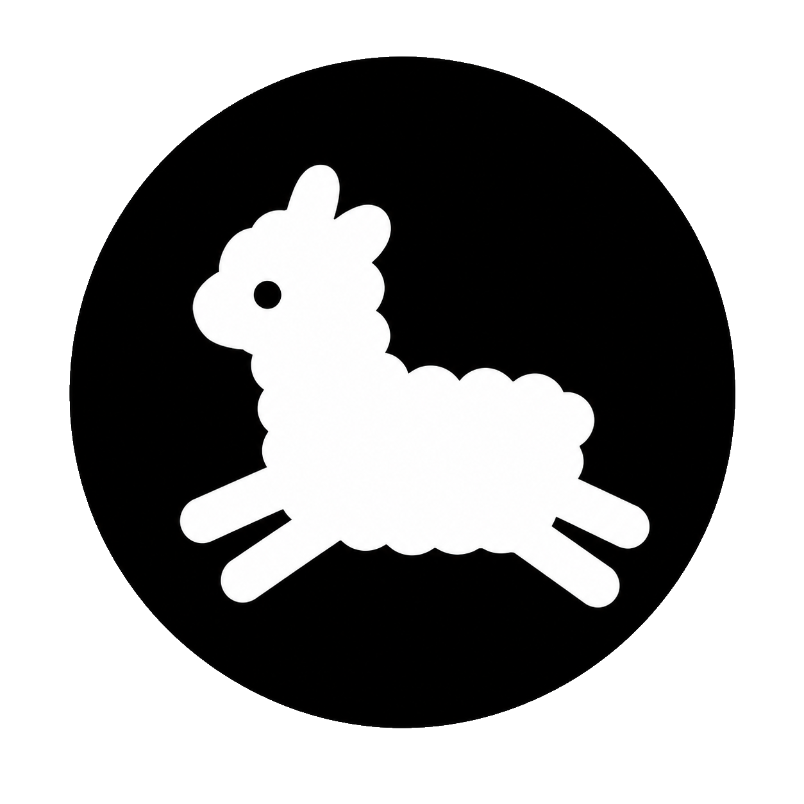

<p align="center">
  
</p>

# Alparts

**チームの会話を、自分たちのサーバーで。**

Alpartsは、チャンネルでのチャット、ダイレクトメッセージ、ファイル共有、音声通話をひとつにまとめた、セルフホスト型のコミュニケーションアプリです。チームやプロジェクトごとに会話の場所を作り、参加者と公開範囲を自分たちで管理できます。

メッセージ本文と添付ファイルは、送信前に端末で暗号化するエンドツーエンド暗号化に対応しています。Webブラウザー、Windows・macOS・Linux向けデスクトップアプリ、Androidアプリから同じワークスペースを利用できます。

[主な機能](#主な機能) · [ローカルで始める](#ローカルで始める) · [サーバーの運用](#サーバーの運用) · [ドキュメント](docs/INDEX.md)

## 主な機能

### 話題ごとに会話を整理

ワークスペースの中にカテゴリーとチャンネルを作り、プロジェクト、議題、チームごとに会話を分けられます。ワークスペース内で公開するチャンネルと、参加者を限定する非公開チャンネルに対応。同じワークスペースのメンバーとは、1対1のDMやグループDMでも話せます。

### 日々のやり取りを支えるチャット

- Markdown、メンション、返信、スレッド表示、メッセージの編集・削除、リアクション。
- 大切な投稿のピン留め、保存済みメッセージ、メッセージへのリンク。
- 未読表示、お気に入り、ミュート、非表示、チャンネルごとの通知設定。
- 本文・投稿者・チャンネル名での検索。検索はその端末で読み込み済みの履歴を対象とし、検索語をサーバーへ送りません。
- 端末内に暗号化して保存する下書きと送信待ちメッセージ。テキストはオフラインでも送信待ちにでき、接続が戻ると再送します。

### 質問や議題をフォーラムで残す

フォーラムチャンネルでは、タイトル付きの投稿ごとに返信をまとめられます。投稿の一覧は最新の返信順・新しい投稿順で並べ替えられ、管理者が作ったタグで絞り込めます。ピン留め、解決済みの表示、管理者による返信のロック、新しい返信の表示に対応しています。投稿のタイトル・本文・返信は通常のメッセージと同じく端末で暗号化されます。タグ名はチャンネル名と同じくサーバーから見えるため、知られたくない内容は含めないでください。

投稿を作成できる人と返信できる人は、ロールとチャンネルごとの権限で分けて設定できます。

### ファイルを共有し、声で話す

添付ファイルは内容とファイル名を暗号化して共有できます。1ファイル最大100 MiB、1メッセージにつき4件まで添付でき、アップロードの中断・再開にも対応しています。添付ファイルの送信にはオンライン接続が必要です。

音声チャンネルでは最大8人で通話できます。ミュート、音声検出、ボタンを押している間だけ話すプッシュトゥトーク、マイクの切り替え、発言者と接続品質の表示を備えています。対応環境では出力先のスピーカーも切り替えられます。

### 参加者と権限を管理

期限付き・一回限りの招待コードでメンバーを招待できます。ロールの作成と割り当てに加え、カテゴリー・チャンネルごとの閲覧や投稿の権限を設定でき、変更前の確認と、権限が適用される理由の表示にも対応しています。管理画面では招待の取り消しや操作履歴の確認も行えます。

### 端末を確認し、履歴を引き継ぐ

新しい端末の承認、確認コードの照合、不要になった端末の登録解除、ログインの終了を管理できます。Web版ではパスキーでのログインと重要操作の本人確認に対応しています。

履歴の復元を設定すると、対応するパスキーまたは保管済みの復旧コードで、保存した履歴を別の端末へ引き継げます。デスクトップ・Androidアプリには、端末の保護機能を使った鍵の保存とアプリのロックも備えています。

## 利用できるクライアント

| クライアント | 対応環境・特徴 | 手順 |
| --- | --- | --- |
| Web | ブラウザーから利用。狭い画面ではスワイプでチャンネルと会話を切り替え | [ローカル起動](#ローカルで始める) |
| デスクトップ | Windows、macOS 13以降、Linux。各OSのx64・ARM64向けパッケージ構成を用意 | [デスクトップガイド](docs/DESKTOP.md) |
| Android | Android 9以降の開発版。端末の画面ロックとHTTPSの接続先が必要 | [Androidガイド](docs/ANDROID.md) |

パスキーの登録・ログイン・本人確認はWeb版で行います。履歴復元の新規設定にはPRF対応のパスキーが必要です。デスクトップ・Android版で履歴を復元する場合は、保管済みの復旧コードを使います。

## ローカルで始める

### 必要なもの

- LinuxまたはmacOSのBash環境
- Node.js **24.8.0以上**、pnpm **11.21.0**
- 起動済みのDockerとDocker Composeプラグイン
- OpenSSL、`sudo`でDockerを実行できる権限

### 起動

リポジトリのルートで実行します。

```bash
./dev.sh
```

初回は開発用の認証情報を生成して`.env`に保存し、PostgreSQLとS3互換ストレージ（SeaweedFS）の起動、依存パッケージのインストール、データベースの移行、監査チェックポイントの初期化を行ってから、WebとAPIを起動します。Dockerの操作には`sudo docker compose`を使用します。

| 接続先 | URL |
| --- | --- |
| Web | <http://localhost:5173> |
| API | <http://localhost:3000> |

### 最初のワークスペースを作る

1. Web画面で「アカウント作成」を開きます。
2. `.env`の`REGISTRATION_INVITE_SECRET`の値を「招待コード」に入力し、表示名・メールアドレス・パスワードを設定します。このコードで作成できるのは、そのサーバーの最初のアカウントだけです。
3. ログイン後、左側の「＋」からワークスペースを作成します。最初のテキストチャンネル`general`が自動で作られます。
4. ワークスペースの管理画面で「招待を管理」を開き、メンバー用の招待コードを発行します。受け取った人は、そのコードでアカウントを作成して参加できます。

招待メールの自動送信はありません。発行したコードを相手に安全な方法で共有してください。既存アカウントで別のワークスペースへ参加する場合は、管理画面の「招待を受諾」から入力できます。

別のブラウザーやアプリで同じアカウントを使う場合は、以前から使っている端末の「ログイン中の端末」で確認コードを照合して承認するか、設定済みの履歴復元を使って端末を追加します。履歴を引き継ぐための設定も、この画面の「履歴の復元」から行えます。復旧コードは端末とは別の安全な場所に保管してください。

### デスクトップ・Androidで使う

デスクトップは、`./dev.sh`を動かしたまま別のターミナルで起動します。

```bash
pnpm dev:desktop
```

初回画面の接続先には`http://localhost:5173`を入力します。アプリの画面は同梱され、ローカルの開発サーバーへ接続します。LinuxではOSの鍵保管サービスが必要です。

Androidは、JDK 21とAndroid SDKなどを[Androidガイド](docs/ANDROID.md)に従って用意し、次のコマンドで開発用APKを作成します。

```bash
pnpm android:build
```

出力先は`packages/android/app/build/outputs/apk/debug/app-debug.apk`です。Androidからは端末が到達できるHTTPSのサーバーへ接続してください。ローカル起動時のHTTPアドレスは利用できません。

### 停止と再開

WebとAPIは実行中のターミナルで`Ctrl+C`を押すと停止します。PostgreSQLとストレージも停止するには次を実行します。

```bash
./dev.sh down
```

再開は`./dev.sh`です。停止時にデータ用のボリュームは削除されません。生成された`.env`と`.local/audit-checkpoint.json`も保持してください。

2026-09-30より前に作った開発環境では、`./dev.sh`が「監査記録の移行が済んでいません」と表示して停止します。[監査 head 移行手順](docs/OPERATIONS.md)を確認してから、次のコマンドを一度だけ実行してください。移行後はそのまま起動します。

```bash
./dev.sh audit-head-init
```

## サーバーの運用

Alpartsのサーバーは、**1つのアプリケーションプロセス、PostgreSQL 16、MinIOなどのS3互換ストレージ**で構成します。Webクライアントの配信もサーバーに含まれます。コンテナー向けの[Dockerfile](Dockerfile)・[Compose構成](compose.production.yml)と、Linux向けの[systemdユニット](deploy/alparts.service)を用意しています。

`docker-compose.yml`はローカル開発用のPostgreSQLとS3互換ストレージ（SeaweedFS）を起動します。`compose.production.yml`ではアプリケーションと移行処理を定義しており、データベース・ストレージ・HTTPSのリバースプロキシは別途用意します。

- **接続と認証情報** — 公開するWeb/APIにはHTTPSを使い、`CORS_ORIGINS`に実際の接続元を設定します。認証情報は保護されたファイルから`*_FILE`で渡せます。設定項目は[環境変数の例](.env.example)を参照してください。
- **音声通話** — 初期状態では外部の通話中継サービスを使いません。異なるネットワーク間での接続には、運用者が管理するSTUN/TURNを`VOICE_ICE_SERVERS_JSON`に設定します。TURNには参加者へ渡してよい短命の認証情報を使います。
- **更新とバックアップ** — 更新時はアプリを停止し、バックアップと復元確認を行ってからデータベースを移行します。暗号化バックアップ、日次実行用のsystemdタイマー、隔離環境への復元確認ツールを同梱しています。
- **監視と監査** — 起動・稼働・受付可否の確認用エンドポイント、認証付きメトリクス、操作履歴の整合性検証を備えています。監査チェックポイントは開発環境でも必要です。
- **アプリの配布** — デスクトップのパッケージ化とAndroidのリリースビルドには、接続先の証明書固定設定が必要です。ビルド時の設定と更新時の注意は[配布・運用の設定ガイド](docs/security/AUDIT_ALPARTS_REMEDIATION.md#接続先のビルド設定)を参照してください。

具体的な導入手順は[デプロイガイド](docs/policies/DEPLOYMENT.md)、日常の管理は[運用ガイド](docs/OPERATIONS.md)、データの保全は[バックアップと復元](docs/BACKUP.md)を参照してください。

## 暗号化と現在の対応範囲

本文、添付ファイルの内容、ファイル名は端末で暗号化します。送信者、参加者、投稿時刻、通信量などの情報はサーバーから確認できます。端末や配信されるWebアプリが侵害された場合まで、暗号化だけで保護できるわけではありません。

端末の承認と参加者の変更に応じた鍵の更新を実装していますが、更新には対象となる承認済み端末すべての確認が必要です。オフラインの端末があると送信を待つ場合があります。また、過去の履歴を読むための鍵を保持するため、メッセージ単位の完全な前方秘匿性は保証していません。

履歴の復元には事前の設定と保存が必要です。使える端末、復元用パスキー、復旧コードをすべて失うと、サーバー管理者でも本文を復元できません。方式と移行手順は[アカウント・端末・履歴の保護](docs/security/ACCOUNT_AND_GROUP_SECURITY.md)と[パスキー・復旧コードの設定](docs/security/AUDIT_ALPARTS_REMEDIATION.md#パスキーと復旧コード)に記載しています。

現在は単一サーバー構成が対象です。複数アプリプロセスでの冗長化、自動フェイルオーバー、iOSアプリ、ビデオ通話・画面共有、Bot/Webhook、OIDCによるSSOは未対応です。Androidのバックグラウンド同期・Push通知、ネイティブ版のパスキー連携、自動更新の組み込みも残作業です。

独立した外部セキュリティレビューは未完了です。未公開の脆弱性情報や認証情報など、漏えい時の影響が大きい秘密の共有には使用しないでください。詳しくは[既知の制限](docs/policies/LIMITATIONS.md)と[リスク一覧](docs/RISK_REGISTER.md)を参照してください。

## 開発

### コードの構成

| パス | 内容 |
| --- | --- |
| [packages/client](packages/client) | React・TypeScript・Viteによる共通の画面、暗号化、端末内の状態管理 |
| [packages/server](packages/server) | Node.js・ExpressのAPI、Socket.IO、認証・権限・監査、DrizzleによるDB管理 |
| [packages/shared](packages/shared) | クライアントとサーバーで共有する型・定数・通信の定義 |
| [packages/desktop](packages/desktop) | Electronアプリ、OSの鍵保管、ロック、ファイル保存 |
| [packages/android](packages/android) | Androidアプリ、同梱画面、端末の鍵保管、ロック、ファイル選択・保存 |
| [scripts](scripts) / [deploy](deploy) | バックアップ・復元・配布の検証ツール、systemd設定 |
| [docs](docs) | 設計、運用、セキュリティ、検証記録 |

### 基本の検証

```bash
pnpm install --frozen-lockfile
pnpm lint
pnpm typecheck
pnpm test
pnpm test:backup-security
pnpm test:release
pnpm build
pnpm security:secrets
pnpm audit --prod --audit-level moderate
git diff --check
```

データベースとストレージを使う結合テストは、通常の`pnpm test`とは別に実行します。[CIの構成](.github/workflows/ci.yml)に従って、使い捨てのPostgreSQL・S3互換ストレージと環境変数を用意してください。ストレージは`scripts/ci/start-object-storage.sh`で起動できます。

```bash
pnpm --filter @alparts/server test:integration
pnpm --filter @alparts/server test:account-security
```

結合テストには既存データを含む環境を使わないでください。Androidのビルドとテストは`pnpm android:build`で実行します。開発時の方針とリリース前の確認事項は[開発ガイド](docs/policies/CONTRIBUTING.md)にまとめています。

## ドキュメント

- [ドキュメント一覧](docs/INDEX.md) — 設計・運用・検証資料の入口
- [デスクトップ](docs/DESKTOP.md) / [Android](docs/ANDROID.md) — 各クライアントの起動・ビルド
- [APIとリアルタイム通信](docs/api/README.md) — 開発者向けインターフェース
- [セキュリティ対応記録](docs/security/AUDIT_ALPARTS_REMEDIATION.md) — 修正内容と導入時の設定
- [セキュリティポリシー](docs/policies/SECURITY.md) — 脆弱性の報告方法

## ライセンス

Copyright (c) 2026 SYZD Research. All rights reserved.

利用・複製・改変・再配布などには、法令で認められる場合を除き、SYZD Researchの事前の書面による許可が必要です。詳しくは[LICENSE](LICENSE)を参照してください。
